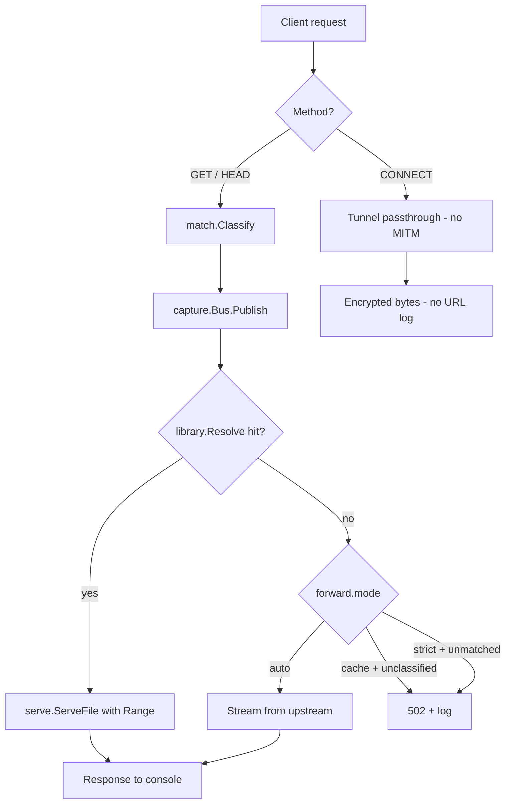

# Architecture

This document describes how `psxdh` is wired internally: the repository layout,
the responsibility of each package, the request pipeline, the session model,
and the testing strategy that protects it.

For the URL patterns the proxy classifies, see
[cdn-patterns.md](cdn-patterns.md). For the on-disk configuration schema, see
[configuration.md](configuration.md). For phase plans and the
definition-of-done, see [roadmap.md](roadmap.md). Architecture decisions live
under [decisions/](decisions/).

---

## Repository layout

```
psxdownloadhelper/
├── cmd/
│   └── psxdh/                  # main entry; cobra commands
├── internal/
│   ├── proxy/                  # HTTP proxy + CONNECT tunnel
│   ├── capture/                # URL classification event bus
│   ├── match/                  # Sony CDN classification rules (PS4/PS5)
│   ├── serve/                  # Local file handler (Range, 206)
│   ├── library/                # Index + fsnotify watcher + path resolver
│   ├── export/                 # FDM / aria2 / txt URL list writers
│   └── config/                 # YAML config load + validate
├── e2e/                        # Cross-package integration tests
├── docs/                       # This documentation tree (incl. ADRs)
├── LICENSE
├── README.md
└── go.mod
```

Planned future packages (see [roadmap.md](roadmap.md) for phases):

| Package | Phase | Responsibility |
| --- | --- | --- |
| `internal/session` | Phase 2 | Aggregate capture events into per-title sessions |
| `internal/manifest` | Phase 2 | Parse PS5 `version.xml` / `.json` to derive expected PKG lists |
| `internal/admin` | Phase 2 | REST + WebSocket for the embedded web dashboard |
| `internal/handoff` | Phase 2 | Best-effort "Send to FDM" (clipboard / deep link / batch) |
| `web/` | Phase 2 | Embedded static dashboard (`embed.FS`) |
| `testdata/urls/` | Phase 0/1 | Redacted real-world URL fixtures |

---

## Package responsibilities

| Package | Responsibility |
| --- | --- |
| `cmd/psxdh` | Cobra CLI entry, command wiring, signal handling, banner output |
| `proxy` | `net/http`-based handler accepting absolute-URI `GET`/`HEAD`; hijack-based `CONNECT` tunnel; forward / cache / strict modes |
| `capture` | In-memory pub/sub bus; emits `Event{URL, Method, Kind, Hint, Headers, Time, ClientAddr}`; back-pressure-safe (per-subscriber drop) |
| `match` | Pluggable classification rules: host suffix + path regex → `Kind`. PS4 + PS5 rule packs as embedded YAML, externally overridable |
| `serve` | Streams files via `http.ServeContent`: `Accept-Ranges`, `206 Partial Content`, RFC 7233 edge cases, constant memory |
| `library` | URL → local path resolver; recursive index keyed by basename; `fsnotify` watcher with partial-write debounce |
| `export` | Write captured URL lists as `.txt` (Phase 1), FDM batch (Phase 2), aria2 input (Phase 2) |
| `config` | YAML load + validation with defaults; CLI overrides applied by `cmd/psxdh` |

Constructors follow the same shape: every package accepts a `Deps` struct (or a
positional arg list of similar size) so tests can wire collaborators directly
without touching globals.

---

## Request handling pipeline



### Design rules

1. **Never MITM HTTPS.** `CONNECT` is bridged as raw TCP. PSN auth, store, and
   login traffic are forwarded byte-for-byte and never decrypted or logged.
2. **Preserve query strings end-to-end.** The proxy log, the FDM handoff URL,
   and the retry upstream all see the exact bytes the console sent
   (`?downloadId=…`, `?du=…`, etc.).
3. **Support `Range` end-to-end.** Console resume relies on `bytes=N-`
   requests. Both forward and local serve paths must preserve / honour them
   correctly.
4. **Idempotent mapping.** The same URL always resolves to the same library
   path. The library resolver never auto-picks between ambiguous candidates;
   it returns "miss" so the proxy falls back to forwarding upstream.
5. **Stream, never buffer.** Large PKGs (10–100 GB) must serve in constant
   memory. Both `forward` and `serve.ServeFile` rely on `io.Copy` /
   `http.ServeContent` so no full body is ever loaded.

### Forward modes

The `forward.mode` config controls what happens when the library cannot
satisfy a request:

| Mode | Behaviour |
| --- | --- |
| `auto` (default) | Forward unmatched traffic upstream. Console keeps working even before any file is FDM-downloaded. |
| `cache` | Forward only requests that classified to a known `Kind`. Unclassified URLs return 502. Useful when you want to be sure the proxy is only seeing the assets you expect. |
| `strict` | Never forward upstream; if no library file exists, return 502. Useful for "library-only" replay or offline diagnostics. |

`CONNECT` is always tunnelled regardless of mode — refusing HTTPS would break
PSN login.

### Hop-by-hop headers

Both the inbound request and the upstream response have hop-by-hop headers
stripped per RFC 7230 §6.1 (`Connection`, `Keep-Alive`, `TE`, `Trailer`,
`Transfer-Encoding`, `Upgrade`, `Proxy-Authenticate`, `Proxy-Authorization`,
plus any names listed in the request's `Connection` header). End-to-end
headers like `Content-Length`, `Content-Range`, and `Accept-Ranges` are
passed through.

---

## Library lifecycle

### Index

`library.Index` is the concurrent-safe in-memory catalogue keyed by basename.
It is populated by:

1. An initial recursive walk in `library.NewIndex`.
2. Watcher-driven `Add` / `Remove` calls as files land or disappear.

`Resolve(*url.URL)` returns `(absPath, true)` only when exactly one library
file matches the URL's basename. The `per-title` layout extends this with a
title-id disambiguator (`PPSA…`, `CUSA…`, `UP1234-CUSA…`) when multiple files
share a basename across titles.

### Watcher

`library.Watcher` wraps `fsnotify` with a partial-write debounce policy that
mitigates the "library watcher races a partial write" risk:

| Event kind | Fires when |
| --- | --- |
| `KindCreated` | The first time fsnotify reports a path. |
| `KindWritten` | Each subsequent fsnotify write while the file is still settling. |
| `KindStable` | The file's size has been unchanged for the configured settle window AND size > 0. **This is the signal** that adds the file to the index. |
| `KindRemoved` | A delete or rename-out. |

Files with one of the configured `ignore_suffixes`
(`.part`, `.fdmdownload`, `.tmp`, `.crdownload`) never enter the state
machine; the final rename into the real basename triggers a fresh
`KindCreated`. This is how the watcher cooperates with FDM, browser
downloaders, and aria2 without seeing a half-written file.

The default settle window is 2 s, matching the
[v1.0 definition of done](roadmap.md#definition-of-done-v10) ("detect new
files within 2 s and update session state").

---

## Session model (Phase 2)

The session aggregator is not implemented yet, but `match.Hint` already
extracts the metadata it will need:

```go
// internal/match/types.go
type Hint struct {
    TitleHint string // CUSA12345 / PPSA01234 / UP1234-CUSA12345
    PartIndex int    // _0, _1, ...  (-1 when not parseable)
}
```

The planned shape (subject to change as we implement it):

```go
type InstallSession struct {
    ID        string
    Platform  string    // "ps4" | "ps5"
    TitleID   string
    Label     string
    StartedAt time.Time
    Parts     []Part
    State     string    // capturing | ready | transferring | complete
}

type Part struct {
    URL       string
    Kind      string    // pkg-base | pkg-app | pkg-sc | ...
    LocalPath string
    Size      int64
    Status    string    // pending | local | served | skipped
    Index     int       // _0, _1, ...
}
```

Differentiating behaviours we want from the session model:

- Auto-group parts by content-id / dirname prefix.
- When a `manifest-json` URL is captured, optionally prefetch and pre-populate
  the expected part list.
- PS5: when `_sc.pkg` is seen, optionally background-fetch the first 64 KB to
  parse `param.json` for display metadata (`capture.prefetch_sc_metadata`).
- Warn the user if they FDM-download a `/ppkgo/` metadata URL that does not
  advance the install bar.

---

## Capture bus

`capture.Bus` is the fan-out point between the proxy and downstream consumers
(session aggregator, admin server, exporters). Implementation rules:

- **Publish is non-blocking.** If a subscriber's buffer is full, the event is
  dropped *for that subscriber only* and counted via `Dropped()`. The proxy
  must never stall waiting on a slow consumer.
- **Subscribers cancel via the returned function.** `Subscribe()` returns
  `(<-chan Event, func())`; calling the cancel func closes the subscription
  and removes the channel.
- **Headers are cloned at publish time.** Subscribers receive a snapshot, so
  the proxy can recycle the original request.

The default subscriber buffer is small (64–1024) because the dashboard /
session aggregator are local consumers — there is no reason to absorb
arbitrary bursts.

---

## Configuration

The on-disk YAML schema, CLI flags, environment overrides, and defaults are
all documented in [configuration.md](configuration.md).

The runtime contract:

1. `config.Load(path)` reads the file, overlays it on top of `config.Default()`
   field-by-field, expands `~` in paths, and runs `Validate()`.
2. `cmd/psxdh` applies CLI overrides (`--listen`, `--library`, `--log-level`)
   after `Load` returns but before passing the config to package constructors.
3. Validation rejects:
   - Empty / unparseable `proxy.listen` / `admin.listen`.
   - Unknown `library.layout` (must be `basename` or `per-title`).
   - Negative `library.stable_settle_ms`.
   - Unknown `forward.mode` (must be `auto` / `cache` / `strict`).
   - Unknown `log.level` (must be `debug` / `info` / `warn` / `error`).

---

## Testing strategy

| Layer | Approach |
| --- | --- |
| Unit | `match` against golden URL fixtures (PS4 + PS5 in `testdata/urls/`, landing in Phase 1) |
| Unit | `serve` Range parsing (RFC 7233 cases: single range, suffix range, out-of-range, HEAD) |
| Unit | `library` URL → path resolution: basename hit, recursive hit, miss, ambiguous match, per-title disambiguation |
| Unit | `library` watcher: create, write, partial-write debounce, ignore-suffix rename, remove |
| Unit | `export` formats: txt (Phase 1), FDM batch + aria2 input (Phase 2) — exact byte output |
| Unit | `config` defaults, YAML overlay, validation errors, `~` expansion |
| Integration | `internal/proxy/server_test.go`: absolute-URI forward, query-string preservation, Range pass-through, library-hit short-circuit, `auto`/`cache`/`strict` modes, capture publication, `CONNECT` against `httptest.NewTLSServer` (no MITM), 405 for unsupported methods, hop-by-hop stripping |
| Integration | `e2e/phase1_test.go`: full proxy → watcher → serve cycle against a fake Sony-CDN-shaped upstream, including the multi-part FDM scenario |
| Manual | Matrix: PS4 base, PS4 patch, PS5 base, PS5 update, DLC (Phase 0 hardware capture, see [roadmap.md](roadmap.md)) |
| Performance | Serve 100 GB file at LAN speed; assert constant memory (Phase 1 exit, validates the streaming claim) |
| Regression | Record anonymised HAR from proxy logs → replay-classify only (no upstream calls). Used to lock the rule pack against unintentional regressions when a new title is observed |

### Test fixture layout

```
testdata/
└── urls/
    ├── ps4/*.txt    # one URL per line, redacted of any personal downloadId
    └── ps5/*.txt
```

Fixtures are produced by the Phase 0 hardware-capture step and committed
redacted. They are the source of truth for the `match` package's golden
tests; a PR that broadens a regex must add or update fixtures so the change
is reviewable.

---

## Concurrency & shutdown

Long-running commands (`psxdh proxy`, `psxdh node`) use
[`internal/lifecycle`](../internal/lifecycle/lifecycle.go) to coordinate
graceful shutdown on **SIGINT** / **SIGTERM**:

1. `signal.NotifyContext` cancels the root context.
2. Lifecycle logs `shutting down gracefully` and waits up to **15 seconds**
   for every registered service to exit.
3. HTTP servers (`proxy`, `admin`, cluster `agent`) call `http.Server.Shutdown`
   with the same 15 s grace via `lifecycle.ShutdownHTTP`.
4. The cluster `Manager` waits for in-flight `assign` / `collect` HTTP before
   returning.
5. Resources close in order: cluster/downloader last on the master
   (`localDL.Close()` after `lifecycle.Run` returns).
6. Lifecycle logs `shutdown complete`, or warns if the drain deadline was hit.

`psxdh proxy` registers these services with lifecycle:

- Library watcher + event drainer
- Proxy (and admin dashboard, if enabled)
- Session aggregator, DNS re-probe, aria2 auto-push, cluster enumerate loop
  (background bus workers)
- Cluster manager + persist worker (when enabled)

`http.Server.ReadHeaderTimeout` is set to 10 s, but no idle or read/write
timeouts are applied on the proxy path — large PKG transfers can legitimately
take hours, and the console will close the connection itself when it's done.
Active transfers get up to 15 s to finish after Ctrl-C before the listener
is force-closed.

---

## Distributed cluster (ADR 0005)

When `cluster.enabled` and `cluster.role: master`, the proxy node also runs a
`cluster.Manager`. The flow:

1. The PS5 proxies through the **master** and requests the first part
   (`…_N.pkg`). A capture-bus subscriber derives the whole series with
   `cluster.Enumerate` (substitute `_N`, probe `_0.._N` until a gap; the query
   string and `f_<hash>` path segment are preserved) and submits it.
2. The manager assigns parts to the least-loaded online **slave** node. Each
   slave (`psxdh node`) runs an embedded `downloader.Downloader` (managed aria2c
   by default; HTTP only when `downloader.allow_http_fallback` is set) behind a
   token-guarded agent API. Startup requires aria2c unless that flag is set.
3. The manager polls each slave's `/node/status`; when a part completes it
   **pulls** the file from the slave (`/node/part/<basename>`, Range-capable)
   into `library.dir` via temp-file + atomic rename.
4. The existing watcher indexes the collected file; the master serves it to the
   PS5 with the same `serve.Handler` (Range/206) used for any library hit.

**Authority rule:** a part is "have it" iff it is present in the master's
library index. This unifies slave-push collection with **manual** moves (drop a
finished part into `library.dir` via USB/SSD and the manager never assigns it).

Slaves are discovered via mDNS (`_psxdh-node._tcp`) or added by IP in the
dashboard. All master↔slave calls carry the shared `cluster.token`. The
downloader sits behind an interface, so the test suite drives the whole cluster
in-process with no aria2c and no network (see `internal/cluster` and
`internal/downloader` tests).
