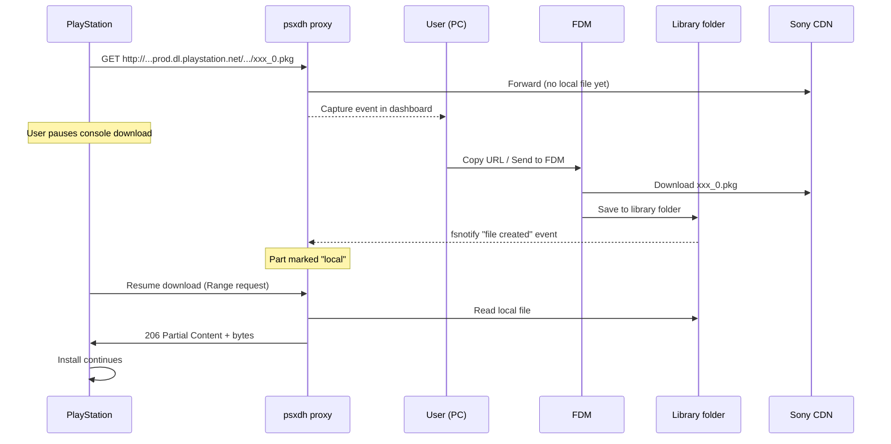

# Roadmap

This document is the product-and-engineering side of `psxdh`: the vision, the
user flows, the success criteria, the implementation phases, the technical
risks, the open questions, and the v1.0 definition of done.

For how the system is built, see [architecture.md](architecture.md). For URL
patterns, see [cdn-patterns.md](cdn-patterns.md). For configuration, see
[configuration.md](configuration.md). For prior art and references, see
[research.md](research.md).

---

## Vision

**One sentence:** Help PlayStation owners who already own content on PSN
download faster by capturing the official CDN URL on a PC proxy, downloading
those files with **Free Download Manager (FDM)** — or any other PC
downloader — dropping them into a watched library folder, and serving them
back to the console over LAN with full HTTP `Range` support.

### Core workflow

1. Console points its system HTTP proxy at the PC running `psxdh`.
2. The proxy logs every official CDN URL as the console requests it and
   classifies it (base PKG, patch PKG, manifest, etc.).
3. User copies the URL from the dashboard (or exports a batch list) into
   **FDM** and downloads the file at PC speed.
4. The library watcher detects the new file in the configured folder and
   marks that part as *local* in the active session.
5. Console retries or resumes the request; the proxy serves the local file
   with `206 Partial Content` so the install bar advances.

**No built-in downloader in v1.** The PC user keeps full control of
bandwidth, scheduling, mirrors, and resume via FDM. aria2, IDM, JDownloader,
curl, and wget all work the same way — the app just needs to hand off a URL
list.

### Success criteria (v1.0)

| Goal | Measure |
| --- | --- |
| PS5 retail downloads work end-to-end | Base game + title update + DLC on real hardware (2+ titles, small + large) |
| PS4 parity | Same flows as the legacy tool for `gs2.*` HTTP PKG chains |
| Cross-platform | macOS (Intel + Apple Silicon), Windows, Linux — single static binary |
| Reliable local serve | `Range` requests, correct `Content-Length`, `206` responses, resume after pause |
| FDM-friendly handoff | One-click copy URL, plain-text `.txt` URL list, deep link / batch file FDM can import |
| Observable | Every PKG/manifest URL logged; live dashboard; session progress per title |
| Safe defaults | No MITM of HTTPS PSN traffic; clear legal-use disclaimer |

### Non-goals (v1)

- ~~Built-in downloader (deferred indefinitely).~~ **Reversed:** psxdh now
  embeds a managed aria2c to power the distributed cluster — see
  [ADR 0005](decisions/0005-distributed-downloader.md). External downloaders
  (FDM/aria2/IDM) remain supported for non-cluster use.
- Piracy, licence bypass, or downloading content the user does not own.
- Remote Package Installer / homebrew PKG sideloading
  (DirectPackageInstaller, PSXhub, etc.).
- Store browsing optimisation while proxied.
- Built-in torrent or unofficial CDN support.
- HTTPS interception / MITM of any PSN traffic.

---

## User flows

### User stories

| ID | Story |
| --- | --- |
| U1 | As a PS5 user, I start a download, copy the captured URL into FDM, pause on the console, let FDM finish at PC speed, and resume on the console so the install bar advances from the local file. |
| U2 | As a user with a multi-part game (`_0.pkg` … `_N.pkg`), I want one session that lists every part, marks each one *pending → local → served*, and tells me what is still missing. |
| U3 | As a PS5 user installing a **title update**, I want `_sc.pkg`, delta `*-DP.pkg`, and `.crc` assets detected and handled, not only base `app` chunks. |
| U4 | As a PS4 user, I want existing `appkgo` / `ppkgo` URL patterns to work without PS5-specific configuration. |
| U5 | As a power user, I want CLI + config file for headless proxy on a NAS or always-on PC. |
| U6 | As a first-time user, I want the app to show my LAN IP, proxy port, and step-by-step console setup. |
| U7 | As a user with FDM already installed, I want a one-click "Send to FDM" action (clipboard, deep link, or `.txt` batch import) so I never have to copy/paste URLs manually. |

### Target UX sequence

---

## Feature matrix (2026)

| Feature | KOPElan (legacy) | nodejs (legacy) | PSXMaster | **psxdownloadhelper (target)** |
| --- | --- | --- | --- | --- |
| Windows | yes | yes | yes | yes |
| macOS / Linux | no | yes (CLI) | no | **yes** |
| PS5 game transfer | community | untested | yes | **yes (validated)** |
| Open source | GPL-3.0 | yes | MIT | **MIT** |
| Match rules | built-in | one regex | broad extension | external rule packs + defaults |
| Range / resume serve | yes | partial | yes | yes (first-class) |
| URL log UI | yes | console only | WinUI | web + CLI |
| Auto file find | manual | basename | recursive by filename | recursive + optional per-title |
| Multi-part session | manual | manual | log list | **session tracker** |
| FDM / external downloader handoff | manual | manual | manual | **copy + export + best-effort deep link** |
| Headless / NAS | no | CLI only | no | **yes** |
| Built-in downloader | no | no | no | **embedded aria2** (ADR 0005); external still supported |
| Distributed multi-machine download | no | no | no | **yes** (master/slave cluster) |
| Partial update diff | no | no | no | optional later (PSXhub-inspired, Phase 4) |
| Custom DNS / DoH | no | no | no | **yes** (Phase 2.5) |
| Upstream VPN / SOCKS5 chain | no | no | no | **yes** (Phase 2.5) |
| Forward-path retry w/ backoff | no | no | no | **yes** (Phase 2.5) |
| Diagnostic CLI | no | no | no | **yes** (`doctor`, `probe`) |
| Cross-run resumable downloads | no | no | no | **yes** (partial-cache resume) |
| Integrity verify before serve | no | no | no | **yes** (`.crc` + size gate) |
| DNS resolver health ranking | no | no | no | **yes** |
| Web dashboard (live log + sessions) | yes | no | WinUI | **yes** (embedded, LAN + token) |
| aria2 live handoff (JSON-RPC push) | no | no | no | **yes** |
| mDNS LAN announce | no | no | no | **yes** (`_http._tcp`) |

See [research.md](research.md) for who these references are.

---

## Implementation phases

### Phase 0 — Research & validation

Side-by-side with PSXMaster on the same titles (gold standard for *works
today*), hardware tests on PS5 + PS4, FDM handoff smoke test, decide proxy
stack (recorded in [ADR 0001](decisions/0001-proxy-stack.md)), freeze URL
rule tables + `testdata/urls/` fixtures.

#### Phase 0 validation checklist

- [ ] PS5: capture full proxy log for one small free title + one large title
      + one title update.
- [ ] Classify each asset: plain-HTTP (absolute URL visible) vs
      `CONNECT`-only.
- [ ] Confirm `gst.prod` multi-part `_*.pkg` sequence and ordering.
- [ ] Confirm `Range` / `206 Partial Content` interaction (`Content-Range`,
      `bytes=…`).
- [ ] Title update: which of `_sc.pkg`, `-DP.pkg`, `.crc`, `.json` are
      proxy-visible vs tunnelled.
- [ ] Test **with and without** a custom primary DNS — do not hardcode any
      third-party DNS in v1 unless empirically required.
- [ ] PS4 regression: one `appkgo` multi-chunk title on the same proxy build.
- [ ] **FDM handoff smoke test:** copy a captured URL into FDM, confirm the
      file downloads identically to the console request and lands with the
      correct basename.
- [ ] Export redacted URL fixtures to `testdata/urls/` for unit tests.

If PS5 game PKGs turn out to be `CONNECT`-only on current firmware, v1 cannot
meet "full PS5 support" without a different architecture — see
[Fallback strategies](#fallback-strategies). Desk research suggests this is
unlikely for the main game payload but possible for some update metadata.

**Exit criteria:** every checklist item ticked.

### Phase 1 — Core proxy (MVP)

- HTTP proxy with absolute-URI handling + `CONNECT` passthrough. **Done**
  (`internal/proxy/`).
- `match` + `capture` + structured logging. **Done**.
- `library` basename mapping with recursive walk + `fsnotify` watcher.
  **Done**.
- `serve` with full `Range` support. **Done**.
- `export` package: plain `.txt` URL list. **Done**.
- CLI: `psxdh proxy --listen 0.0.0.0:8080 --library ~/Downloads/psxdh`.
  **Done**.

**Exit:** PS4 multi-chunk title completes install via FDM-downloaded files.
Validated end-to-end against the test suite (`e2e/phase1_test.go`); hardware
validation remains in Phase 0.

### Phase 2 — PS5 completeness + handoff (**mostly done**)

- PS5 rule set + manifest helpers (`internal/manifest`). *(rules done;
  manifest helpers still ahead)*
- Session aggregation + missing-part detection (`internal/session`). **Done.**
- Admin HTTP API + embedded web dashboard (live SSE log, sessions, library
  state, connectivity panel, per-URL "send to aria2") (`internal/admin`,
  embedded `web/`). **Done** — LAN bind + token auth.
- `handoff` package: aria2 JSON-RPC push + auto-push (`internal/handoff`).
  **Done.** FDM deep link / clipboard still ahead.
- Export to aria2 input format. **Done** (`export.WriteAria2`, `psxdh export`,
  dashboard export buttons). FDM batch format still ahead.
- Portable capture jobs: JSONL import/export, `jobs.*` config, persisted job
  state, `psxdh import` CLI, dashboard import. **Done.**

**Exit:** PS5 base + title update install on 2 titles using the handoff
workflow (pending Phase 0 hardware validation).

### Phase 2.5 — Network resilience (**done**)

Implemented under [ADR 0003](decisions/0003-network-resilience.md). Adds
the opt-in stack documented in
[docs/network-resilience.md](network-resilience.md):

- `internal/netresolve` — DoH + UDP + system fallback + TTL cache.
- `internal/retry` — pre-byte-write retry policy with jitter.
- `internal/circuit` — per-host failure breaker.
- `internal/bandwidth` — token-bucket rate limiter.
- `internal/upstream` — `*http.Client` builder wiring all of the above
  plus SOCKS5/HTTP proxy chaining + IPv4 preference.
- `internal/persist` — JSONL capture log surviving restarts.
- `internal/verify` — `.crc` framework (parser stubs until Phase 0 locks
  the format).
- `cmd/psxdh doctor` and `cmd/psxdh probe` diagnostics.
- Proxy integration: forward retry, partial cache write-through.

All defaults preserve the pre-2.5 behaviour bit-for-bit.

### Phase 3 — Polish & distribution (**partly done**)

- Config file + env overrides + hot-reload. *(file done; env/hot-reload ahead)*
- Setup wizard content (PS4 + PS5 proxy screenshots, step-by-step) under
  `docs/console-setup/`. *(ahead)*
- Release binaries (GoReleaser): amd64/arm64 for Windows, macOS, Linux.
  **Done** — `.goreleaser.yaml` + tag-triggered release workflow.
- CI matrix (build + race tests + vet + golangci-lint) across the three
  OSes. **Done** — `.github/workflows/ci.yml`, `.golangci.yml`.
- mDNS LAN announce (`psxdh._http._tcp`). **Done** — see
  [ADR 0004](decisions/0004-mdns.md).
- Integration docs for FDM, aria2, IDM, JDownloader. *(aria2 done in
  [network-resilience.md](network-resilience.md); others ahead)*

**Exit:** v1.0 release.

### Phase 4 — Optional enhancements (post-v1.0)

- TUI (Bubble Tea) — requires its own ADR per
  [ADR 0002](decisions/0002-dependency-budget.md).
- Delta / partial update advisor ("only fetch parts X, Y, Z" — PSXhub-
  inspired, clean-room).
- PS4 1.00 launch-version workflow guide automation.
- ~~mDNS announce proxy on LAN~~ — **shipped** (moved to Phase 3, ADR 0004).
- Optional native GUI (only if the web dashboard proves insufficient).
- *Built-in downloader is deliberately not on this list.* If demand emerges,
  revisit — but FDM already does this better.

---

## Technical risks & mitigations

| Risk | Impact | Mitigation |
| --- | --- | --- |
| PS5 CDN switches to HTTPS-only / `CONNECT`-only for game PKGs | Cannot log or replace URLs | Phase 0 spike; document limitation; pursue [fallback strategies](#fallback-strategies) |
| Sony changes URL layout | Rules go stale | External rule file; versioned `match` schema; community PRs |
| Wrong part served | Corrupt install | Strict URL → path match; optional size check; never rename files arbitrarily |
| Proxy breaks Store / PSN auth | Bad UX | Default `auto` forward mode; never MITM HTTPS; "PSN safe mode" doc |
| Large files / RAM | OOM | Stream only; `io.Copy` / `http.ServeContent` end-to-end; no full buffering |
| FDM URL truncated when copy-pasted | File mismatch or 403 | Always preserve query string; "Copy URL" copies the exact original |
| FDM not installed / no deep link | Friction | Fallback chain: clipboard → batch export → manual download |
| Library watcher races a partial write | Empty / wrong file served | Detect write-complete (size stable for N ms) before marking stable; `serve` re-checks size at open time |
| GPL contamination from KOPElan / PSXhub | Licence conflict | Clean-room MIT implementation; PSXMaster (MIT) is the only readable reference |
| PSXMaster already solves Windows PS5 | Low differentiation | Lead with macOS + Linux + headless + FDM handoff + open rule packs |

### Fallback strategies

If HTTPS blocks the classic proxy approach, document honestly in the README
if encountered:

1. **Dual-NIC / PC routing** — out of app scope; route console traffic
   through a PC NIC.
2. **DNS-only logging** — host-level hints, no replace (degraded mode).
3. **Manual URL paste** — user supplies manifest URL from external
   databases (Prospero Patches and similar). The app drops into a "helper
   mode" without a live proxy.

---

## Open questions

Resolve in Phase 0:

1. ~~Does PS5 send game PKG as plain HTTP through the proxy?~~ **Desk
   research: likely yes (`gst.prod`)** — confirm on current firmware.
2. Which update assets (`_sc.pkg`, `-DP.pkg`, `.crc`) are proxy-visible vs
   `CONNECT`-only?
3. Are `.crc` files mandatory for install progress, or only the PKGs?
4. Is PSXMaster's primary DNS (`165.227.83.145`) ever required, or purely
   author-specific / regional?
5. Should we auto-ignore `/ppkgo/` metadata-only URLs on PS4?
6. Default proxy port: **8080** (PSXMaster + legacy default) — keep unless
   conflict surfaces.
7. ~~Proxy implementation: **stdlib + hijack** vs **`goproxy`** vs **custom
   socket parser**.~~ Decided in
   [ADR 0001](decisions/0001-proxy-stack.md) — stdlib + hijack.
8. Library layout default: **flat basename** vs **per-title folder** — flat
   is the default; per-title is opt-in via config.
9. FDM integration depth: **clipboard + batch export only**, or also **CLI /
   URL-scheme deep link**? — confirm whether current FDM exposes a stable
   handoff on Win/macOS/Linux.
10. Should the dashboard auto-open in the default browser on start, or only
    print the URL? Default today is "print only" (`admin.auto_open: false`).

---

## Definition of done (v1.0)

- [ ] README with install, PS5 proxy setup, PS4 setup, FDM handoff
      walkthrough, legal note.
- [ ] `psxdh proxy` runs on Windows, macOS, Linux from a single static
      binary.
- [ ] Embedded web dashboard shows captured URLs, sessions, library state.
- [ ] PS4: multi-part game installs from the local library after FDM
      download.
- [ ] PS5: base + update successfully installed on 2 documented test titles
      via the FDM workflow.
- [ ] `Range` requests verified against the `serve` test matrix.
- [ ] `fsnotify` watcher detects new files within 2 s and updates session
      state.
- [ ] Export to `.txt`, FDM batch, and aria2 input formats verified by unit
      tests.
- [ ] Config file + example committed.
- [ ] GoReleaser artefacts published for amd64 + arm64 on all three OSes.

---

## Next step

1. Review the current landscape ([research.md](research.md)) and the
   [open questions](#open-questions).
2. Execute **Phase 0** on real PS5 + PS4 hardware — compare logs to
   PSXMaster on the same downloads and run the FDM handoff smoke test.
3. Lock URL rules + proxy stack + FDM handoff depth → finish **Phase 2**.
