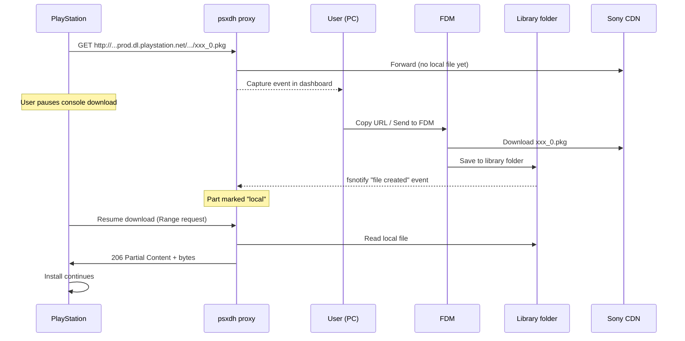
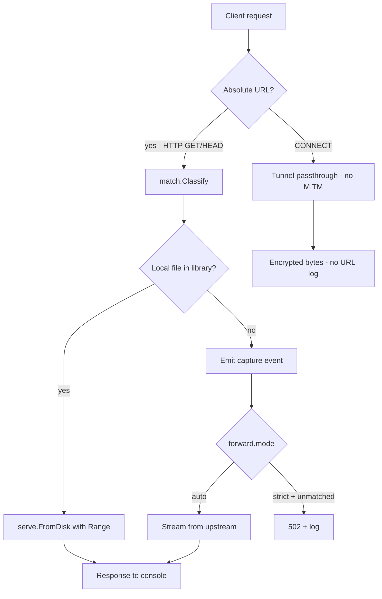

# psxdownloadhelper — Product & Technical Plan

A cross-platform **Go** reimplementation of [PSX Download Helper](https://github.com/KOPElan/PSX-Download-Helper) with **first-class PS5 support**, an **external-downloader workflow built around Free Download Manager (FDM)**, and a maintainable architecture. This document is the blueprint **before** any implementation.

> Status: pre-implementation. All console-specific claims are flagged with confidence levels and tracked in §13 *Open Questions*. Phase 0 (§8) is a hard gate before any production code.

---

## 1. Vision

**One sentence:** Help PlayStation owners who already own content on PSN download faster by capturing the official CDN URL on a PC proxy, downloading those files with **FDM** (or any other PC downloader), dropping them into a watched library folder, and serving them back to the console over LAN with full HTTP `Range` support.

### 1.1 Core workflow (v1)

1. Console points its system HTTP proxy at the PC running `psxdh`.
2. The proxy logs every official CDN URL as the console requests it and classifies it (base PKG, patch PKG, manifest, etc.).
3. User copies the URL from the dashboard (or exports a batch list) into **FDM** and downloads the file at PC speed.
4. The library watcher detects the new file in the configured folder and marks that part as *local* in the active session.
5. Console retries or resumes the request; the proxy serves the local file with `206 Partial Content` so the install bar advances.

**No built-in downloader in v1.** The PC user keeps full control of bandwidth, scheduling, mirrors, and resume via FDM. Aria2, IDM, JDownloader, curl, and wget all work the same way (the app just needs to hand off a URL list).

### 1.2 Success criteria (v1.0)

| Goal | Measure |
|------|---------|
| PS5 retail downloads work end-to-end | Base game + title update + DLC on real hardware (2+ titles, small + large) |
| PS4 parity | Same flows as legacy tool for `gs2.*` HTTP PKG chains |
| Cross-platform | macOS (Intel + Apple Silicon), Windows, Linux — single static binary |
| Reliable local serve | `Range` requests, correct `Content-Length`, `206` responses, resume after pause |
| FDM-friendly handoff | One-click copy URL, plain-text `.txt` URL list, deep link / batch file FDM can import |
| Observable | Every PKG/manifest URL logged; live dashboard; session progress per title |
| Safe defaults | No MITM of HTTPS PSN traffic; clear legal use disclaimer |

### 1.3 Non-goals (v1)

- Built-in downloader (deferred indefinitely — FDM and friends already do this better).
- Piracy, licence bypass, or downloading content the user does not own.
- Remote Package Installer / homebrew PKG sideloading (DirectPackageInstaller, PSXhub, etc.).
- Store browsing optimisation while proxied.
- Built-in torrent or unofficial CDN support.
- HTTPS interception / MITM of any PSN traffic.

---

## 2. Problem & User Flows

### 2.1 Why this exists

Console WAN downloads are often slower, less resilient, and harder to manage than PC download managers. Sony serves the large `.pkg` chunks from CDNs over HTTP for the bulk of the payload. `psxdownloadhelper` sits in the middle as a thin LAN HTTP cache that captures the URLs, lets the user pull them with FDM, and serves the cached file back when the console retries.

### 2.2 Primary user stories

| ID | Story |
|----|--------|
| U1 | As a PS5 user, I start a download, copy the captured URL into FDM, pause on the console, let FDM finish at PC speed, and resume on the console so the install bar advances from the local file. |
| U2 | As a user with a multi-part game (`_0.pkg` … `_N.pkg`), I want one session that lists every part, marks each one *pending → local → served*, and tells me what is still missing. |
| U3 | As a PS5 user installing a **title update**, I want `_sc.pkg`, delta `*-DP.pkg`, and `.crc` assets detected and handled, not only base `app` chunks. |
| U4 | As a PS4 user, I want existing `appkgo` / `ppkgo` URL patterns to work without PS5-specific configuration. |
| U5 | As a power user, I want CLI + config file for headless proxy on a NAS or always-on PC. |
| U6 | As a first-time user, I want the app to show my LAN IP, proxy port, and step-by-step console setup (PS5: Settings → Network → Set Up Internet Connection → Advanced → Proxy). |
| U7 | As a user with FDM already installed, I want a one-click "Send to FDM" action (clipboard, deep link, or `.txt` batch import) so I never have to copy/paste URLs manually. |

### 2.3 Target UX sequence



---

## 3. Current Landscape — read this first

The original draft leaned on 2014–2021 repos that no longer represent how the PS4 / PS5 CDN behaves. Treat older repos as **historical reference only**; validate everything against current tools and current hardware. Project metadata below was correct at last check (30/05/2026) but **verify before relying on specifics** — any of these can be archived, renamed, or relicensed.

### 3.1 Still relevant on stock PS4 / PS5 (no exploit)

| Project | Role vs our Go app | Notes |
|---------|-------------------|--------|
| [ghost1372/PSXMaster](https://github.com/ghost1372/PSXMaster) | **Primary modern reference / competitor** | WinUI, MIT, PS4 + PS5 "Game Transfer" proxy. Default port **8080**, broad match rules (`*.pkg` / `*.pup`), recursive filename lookup in library tree, Range-aware local serve, raw socket HTTP parser (not `goproxy`). Tunnels `CONNECT` without MITM. |
| [KOPElan/PSX-Download-Helper](https://github.com/KOPElan/PSX-Download-Helper) | Historical architecture | GPL-3.0 WinForms; first implementation of intercept + replace. Do **not** copy code — clean-room only. |
| [harryi3t/psx-download-helper-nodejs](https://github.com/harryi3t/psx-download-helper-nodejs) | Pattern reference only | Single PS4 regex; weak passthrough; not a PS5 baseline. |
| [lyling/x-download-helper](https://github.com/lyling/x-download-helper) | Go spike only | No PS5 rules, no Range. Not a baseline. |

**PSXMaster behaviour worth replicating (from source + community reports — confirm in Phase 0):**

- Game PKGs on PS5 typically observed on `http://gst.prod.dl.playstation.net/...` with multi-part names (`..._0.pkg`, `..._1.pkg`, …).
- Match rules deliberately broad: `*.pkg` / `*.pup` extension match, configurable.
- Logs the URL **before** the query string for display; local serve uses path + `Range` + `206 Partial Content`.
- Setup: LAN cable, console HTTP proxy → PC IP:port.
- `CONNECT` requests are tunnelled when no local file exists; HTTPS PSN traffic is **never** decrypted.
- Community guides occasionally mention a custom primary DNS (`165.227.83.145`). Treat as **author-specific / unverified** — do not hardcode in v1; Phase 0 to confirm whether it is ever actually required.

### 3.2 Related tools (different problem; borrow ideas only)

| Project | Audience | Overlap |
| --- | --- | --- |
| [IRONB0SS/PSXhub](https://github.com/IRONB0SS/PSXhub) | Retail PKG LAN transfer | Not a proxy. Strong PS5 PKG diff ("only download parts 0, 22, 23"). Inspiration for an optional partial-update advisor (§8 Phase 4). GPL-3.0 — keep clean-room. |
| [ps5-payload-dev/fetchpkg](https://github.com/ps5-payload-dev/fetchpkg) | Jailbroken PS5 | Manifest-driven official update download; supports `-p http://proxy:8080`. Useful for manifest URL examples, not the stock-console flow. GPLv3+. |
| [marcussacana/DirectPackageInstaller](https://github.com/marcussacana/DirectPackageInstaller) | Exploit / RPI / etaHEN | Proxied PKG install on exploited consoles. Different stack. |
| [Ailyth99/RewindPS4](https://github.com/Ailyth99/RewindPS4) | PS4 version downgrade | Uses `elazarl/goproxy`; author confirms "PS4 games only, not PS5 games". Good reference for Go proxy patterns. |
| ps5upload / PS5 Vault style tools | Homebrew transfer & backup | Fast LAN to exploited PS5. Out of scope for retail PSN proxy. |

### 3.3 Research gaps (resolved on **your** hardware in Phase 0)

| Topic | Status after desk research | Phase 0 action |
| --- | --- | --- |
| PS5 base game via `gst.prod` over plain HTTP | **Likely yes** per PSXMaster community evidence | Packet log on one small + one large title |
| PS5 update assets (`sgst`, `_sc.pkg`, `-DP.pkg`, `.crc`) | Documented on psdevwiki | Confirm which appear as proxy-visible HTTP vs HTTPS-only |
| HTTPS-only PKG (no absolute URL visible to proxy) | **Risk remains** for some assets | Tunnel `CONNECT` without MITM; document fallbacks |
| `.crc` mandatory for install progress | **Unknown** | Test with and without |
| Custom primary DNS requirement | **Unknown** | Test with and without `165.227.83.145` |
| FDM URL preservation when copy-pasted | **Likely fine** | Confirm with an actual `?downloadId=…` URL |

### 3.4 Positioning — why build this in Go anyway?

PSXMaster is the functional bar on Windows. A Go rewrite is justified if we deliver:

1. **macOS + Linux** as first-class (PSXMaster is Windows / Microsoft Store focused).
2. **Headless CLI + NAS** operation without WinUI.
3. **FDM-first handoff** (clipboard, deep link, batch import) with no built-in downloader complexity.
4. **External, versioned URL rule packs** and open, testable `match` fixtures.
5. **Session model** with progress tracking and missing-part detection.
6. **No vendor-specific DNS** unless empirically required.
7. **Optional, later:** PSXhub-style chunk diff (clean-room, MIT) for delta-only update flows.

---

## 4. Platform & CDN Landscape (Research Baseline)

References: [PS4 Online Connections](https://www.psdevwiki.com/ps4/Online_Connections), [PS5 Online Connections](https://www.psdevwiki.com/ps5/Online_Connections).

### 4.1 PS4 (well documented)

| Asset | Host / path pattern | Notes |
|-------|---------------------|--------|
| Base game PKG | `http://gs2.ww.prod.dl.playstation.net/gs2/appkgo/.../*.pkg` | Often chunked `_0` … `_N` |
| Base manifest | `.../f/*.json` | Derive `.pkg` list from JSON |
| Patch manifest | `.../ppkgo/.../*.json` | Prefer `/appkgo/` chunks for install; ignore pure metadata-only URLs that do not advance the bar |
| Patch PKG | `.../ppkgo/.../*.pkg`, `*-DP.pkg` | Delta packages |
| Query params | `downloadId`, `du`, `q`, etc. | Must be preserved end-to-end (proxy log, FDM URL, retry) |

Legacy Node proxy regex (port 8081): only matches `gs2.ww.prod.dl.playstation.net` with `?downloadId` — too narrow for full app coverage.

### 4.2 PS5 (must be first-class)

| Asset | Host / path pattern | Notes |
|-------|---------------------|--------|
| Title update XML | `https://sgst.prod.dl.playstation.net/.../*-version.xml` | Entry point for update discovery (often HTTPS) |
| Update JSON | `.../app/info/.../*.json` | Links to pieces |
| PlayGo / info PKG | `.../*_sc.pkg` | **Critical** — embeds `param.json` metadata |
| Application PKG | `http://gst.prod.dl.playstation.net/.../app/pkg/.../*.pkg` | May be split into many parts |
| Delta PKG | `.../*-DP.pkg` | Cumulative patch |
| Chunk CRC | `.../*.crc` | May be required alongside PKG |
| NP / title paths | `.../sgst/prod/00/np/{TITLE_ID}/...` | Title-id centric layout (`PPSA…`, `UP…`) |

**Differences that shape the design:**

1. **Hostnames:** `sgst.prod.dl` + `gst.prod.dl` (PS5) vs `gs2.ww.prod.dl` (PS4).
2. **Naming:** `_sc.pkg`, `-DP.pkg`, `version.xml` vs `appkgo`/`ppkgo` trees.
3. **Manifest graph:** JSON/XML indirection; a single "game" can be many URLs.
4. **HTTPS vs HTTP:** Update metadata is often HTTPS on `sgst.prod`; game chunk PKGs are reported as plain HTTP on `gst.prod`. Sony can change this — Phase 0 must confirm on current firmware.

### 4.3 Phase 0 — Validation checklist (gate before §6/§8 Phase 1)

Reproduce PSXMaster's Game Transfer flow first, then repeat with our proxy and diff the logs.

- [ ] PS5: capture full proxy log for one small free title + one large title + one title update.
- [ ] Classify each asset: plain-HTTP (absolute URL visible) vs `CONNECT`-only.
- [ ] Confirm `gst.prod` multi-part `_*.pkg` sequence and ordering.
- [ ] Confirm `Range` / `206 Partial Content` interaction (`Content-Range`, `bytes=…`).
- [ ] Title update: which of `_sc.pkg`, `-DP.pkg`, `.crc`, `.json` are proxy-visible vs tunnelled.
- [ ] Test **with and without** a custom primary DNS — do not hardcode any third-party DNS in v1 unless empirically required.
- [ ] PS4 regression: one `appkgo` multi-chunk title on the same proxy build.
- [ ] **FDM handoff smoke test:** copy a captured URL into FDM, confirm the file downloads identically to the console request and lands with the correct basename.
- [ ] Export redacted URL fixtures to `testdata/urls/` for unit tests.

**If PS5 game PKGs turn out to be `CONNECT`-only on current firmware:** v1 cannot meet "full PS5 support" without a different architecture. See §9.4 fallback strategies. Desk research suggests this is unlikely for the main game payload but possible for some update metadata.

**Go proxy implementation decision (Phase 0 spike):** compare three options against the captured fixtures:

1. **stdlib `net/http` + custom `Director`** + manual `CONNECT` hijack.
2. **`elazarl/goproxy`** (used by RewindPS4) — quick to integrate, MIT licence.
3. **Custom raw socket parser** (PSXMaster / KOPElan style) — maximum control.

Pick whichever correctly handles **absolute-URI `GET`** + **`CONNECT` tunnel** + **`Range`** together with the simplest code. Default expectation: stdlib + hijack will suffice; `goproxy` only if it removes meaningful boilerplate.

---

## 5. Product Surface

### 5.1 Modes

| Mode | Audience | Description |
|------|----------|-------------|
| **CLI** (`psxdh`) | Power users, CI, NAS | `serve`, `proxy`, `sessions`, `export-urls`, `watch` |
| **Embedded web UI** | All users | Local dashboard on `127.0.0.1:<admin-port>` — single binary, no extra install |
| **TUI** (optional v1.1) | Terminal-friendly | Live log + session pane (Bubble Tea) |
| **Native GUI** (deferred) | Mainstream | Wails or Fyne, only if web UI proves insufficient |

**v1 decision:** Ship CLI + embedded web dashboard in one static binary. No native GUI in v1.

### 5.2 Core dashboard / commands

- **Dashboard banner:** LAN IP, proxy port, status (listening / error), copy-able PS5 setup instructions.
- **Live log:** timestamp, method, URL, classification (`pkg-base`, `pkg-patch`, `pkg-sc`, `manifest`, `ignored`).
- **Session view:** grouped by title / content id; per-part checklist (`pending` → `local` → `served`); disk space estimate; missing-part highlights.
- **Library view:** download root, per-file match status, "Reveal in Finder/Explorer".
- **Per-URL actions:**
  - **Copy URL** (clipboard, with full query string preserved).
  - **Send to FDM** — best-effort deep link / batch file (see §5.4).
  - **Export selected URLs** as `.txt`, FDM batch, or aria2 input file.
  - **Mark part complete** (manual override).

### 5.3 Library detection

- Default layout: **flat by basename** (`library/<filename>.pkg`). Matches how FDM saves by default.
- Optional layout: **per-title folder** (`library/<title-id>/<filename>.pkg`) — useful when running multiple titles in parallel.
- Path resolution: try basename match first, fall back to recursive walk of `library.dir`.
- File watcher: `fsnotify` — emits a `LibraryEvent{Path, Size, Basename}` on create / write-complete / rename.
- Size sanity check (optional): if upstream `HEAD` is available, warn when local size diverges by more than 0.1 %.

### 5.4 FDM handoff

The PC user always retains control of the downloader. The app provides three escalating levels of convenience:

1. **Copy URL** — guaranteed to work everywhere. The URL is exactly what the console requested, query string intact.
2. **Batch export** — write a plain `.txt` file (one URL per line) that FDM can import via *File → Import → Imported list of downloads*. Also write an `aria2.txt` form (`url\n\toption=value`) for aria2 users.
3. **Deep link / native handoff** — best-effort and platform-specific:
   - Windows: shell out to `fdm.exe` with the URL if found on `PATH` or in the default install location; otherwise fall back to clipboard.
   - macOS: try the `fdm://` URL scheme if FDM registers one (Phase 0 to confirm on current FDM release); otherwise fall back to clipboard.
   - Linux: try `fdm` on `PATH`; otherwise fall back to clipboard.

The deep-link path is **optional and progressive** — if it doesn't work on a given system, the user still has copy/export.

### 5.5 Configuration (`config.yaml`)

```yaml
proxy:
  listen: "0.0.0.0:8080"          # console points here
admin:
  listen: "127.0.0.1:8081"        # dashboard + REST/WebSocket
library:
  dir: "~/Downloads/psxdh"
  layout: "basename"              # basename | per-title
  watch: true                     # fsnotify on library.dir
match:
  ps4: true
  ps5: true
  rules_dir: ""                   # optional override pack
capture:
  log_ignored: false
  export_formats: ["txt", "fdm", "aria2"]
handoff:
  fdm:
    enabled: true                 # try Send-to-FDM action
    fdm_binary: ""                # auto-detect when empty
    fallback_to_clipboard: true
forward:
  mode: "auto"                    # auto (forward unmatched) | strict (block unmatched)
  passthrough_https: true         # tunnel CONNECT without MITM
log:
  level: "info"
  json: false
```

---

## 6. Architecture (Go)

### 6.1 Repository layout

```
psxdownloadhelper/
├── cmd/
│   └── psxdh/                  # main entry, cobra commands
├── internal/
│   ├── proxy/                  # HTTP proxy + CONNECT tunnel
│   ├── capture/                # URL classification, event bus
│   ├── match/                  # Sony CDN patterns (PS4/PS5)
│   ├── session/                # InstallSession state machine
│   ├── serve/                  # Local file handler (Range, 206)
│   ├── library/                # Index + fsnotify watcher + path resolver
│   ├── export/                 # FDM / aria2 / txt URL list writers
│   ├── handoff/                # OS-specific "Send to FDM"
│   ├── manifest/               # JSON / XML helpers (derive missing .pkg)
│   ├── admin/                  # REST + WebSocket for embedded UI
│   └── config/
├── web/                        # Embedded static dashboard (embed.FS)
├── testdata/
│   └── urls/                   # redacted real-world fixtures
├── docs/
│   └── console-setup/          # PS4, PS5 screenshots + steps
├── plan.md
├── README.md
└── go.mod
```

### 6.2 Component responsibilities

| Package | Responsibility |
| --- | --- |
| `proxy` | `net/http`-based handler accepting absolute-URI `GET`/`HEAD`; hijack-based `CONNECT` tunnel; forwards unmatched traffic |
| `capture` | Emit `CaptureEvent{URL, Kind, TitleHint, PartIndex, Headers, Time}` |
| `match` | Pluggable rules: host suffix, path regex, extension. PS4 + PS5 rule sets, externally overridable |
| `session` | Aggregate events into `InstallSession` with ordered `Parts` |
| `library` | URL → local path; recursive index; `fsnotify` watcher; basename + path strategies |
| `serve` | Stream file with `Accept-Ranges`, `206 Partial Content`, `application/octet-stream` |
| `export` | Write URL lists in `.txt`, FDM batch, aria2 input format |
| `handoff` | Best-effort `Send to FDM` per OS; falls back to clipboard |
| `manifest` | Fetch `.json` / `.xml` when allowed; list expected PKGs; PS5 `version.xml` → JSON → PKG hints |
| `admin` | Health, sessions API, WebSocket for live events, static UI |
| `config` | Load / validate / hot-reload |

### 6.3 Request handling pipeline



**Design rules:**

- **Never** MITM HTTPS. PSN auth, store, and login traffic must remain untouched.
- **Preserve query strings** end-to-end (proxy log, FDM handoff, retry upstream).
- **Support `Range`** end-to-end. Console resume relies on `bytes=N-` requests.
- **Idempotent mapping:** the same URL always resolves to the same library path.
- **Stream, never buffer.** Large PKGs must serve in constant memory.

### 6.4 URL classification (initial rule set)

Implement as data-driven rules (YAML or Go table) so community can update patterns without recompiling.

**Default capture rule (broad):** `*.pkg` or `*.pup` extension match — same as PSXMaster. Host/path rules below add classification labels only.

**PS4 hosts:** `gs2.ww.prod.dl.playstation.net`, `gs2-sec.ww.prod.dl.playstation.net`

| Kind | Pattern hint |
| --- | --- |
| `pkg-base` | `/appkgo/` + `.pkg` |
| `pkg-patch` | `/ppkgo/` + `.pkg` |
| `pkg-delta` | `-DP.pkg` |
| `manifest-json` | `.json` under `appkgo` / `ppkgo` |
| `ignore` | icons, `pronunciation.xml`, small assets (configurable) |

**PS5 hosts:** `sgst.prod.dl.playstation.net`, `gst.prod.dl.playstation.net`

| Kind | Pattern hint |
| --- | --- |
| `pkg-sc` | `_sc.pkg` |
| `pkg-app` | `/app/pkg/` + `.pkg` |
| `pkg-delta` | `-DP.pkg` |
| `manifest-xml` | `version.xml` |
| `manifest-json` | `/app/info/` + `.json` |
| `crc` | `.crc` |
| `ignore` | NP communication hosts (never intercept) |

### 6.5 Session model

```go
// Conceptual — not final API
type InstallSession struct {
    ID        string
    Platform  string    // "ps4" | "ps5"
    TitleID   string    // CUSA… / PPSA… when parsed
    Label     string    // human name if known
    StartedAt time.Time
    Parts     []Part
    State     string    // capturing | ready | transferring | complete
}

type Part struct {
    URL       string
    Kind      string    // pkg-base | pkg-app | pkg-sc | ...
    LocalPath string
    Size      int64     // optional from HEAD or filesystem
    Status    string    // pending | local | served | skipped
    Index     int       // _0, _1, ... when parseable
}
```

**Smart behaviours (differentiators vs legacy):**

- Auto-group parts by dirname prefix / content id.
- When `.json` captured, optionally prefetch the manifest and pre-populate the expected part list.
- PS5: when `_sc.pkg` is seen, optionally background-fetch the first 64 KB to parse `param.json` for display metadata.
- Warn if the user FDM-downloads a `/ppkgo/` metadata URL that will not advance the install bar.

---

## 7. Feature Matrix (2026 comparison)

| Feature | KOPElan (legacy) | nodejs (legacy) | PSXMaster | **psxdownloadhelper (target)** |
| --- | --- | --- | --- | --- |
| Windows | yes | yes | yes | yes |
| macOS / Linux | no | yes (CLI) | no | **yes** |
| PS5 game transfer | community | untested | yes | **yes (validated)** |
| Open source | GPL-3.0 | yes | MIT | **MIT** |
| Match rules | built-in | one regex | broad extension | external rule packs + defaults |
| Range / resume serve | yes | partial | yes | yes (first-class) |
| URL log UI | yes | console only | WinUI | web + CLI |
| Auto file find | manual | basename | recursive by filename | recursive + optional per-title |
| Multi-part session | manual | manual | log list | **session tracker** |
| FDM / external downloader handoff | manual | manual | manual | **copy + export + best-effort deep link** |
| Headless / NAS | no | CLI only | no | **yes** |
| Built-in downloader | no | no | no | deliberately none (use FDM/aria2/etc.) |
| Partial update diff | no | no | no | optional later (PSXhub-inspired, Phase 4) |

---

## 8. Implementation Phases

### Phase 0 — Research & validation (1–2 weeks)

- Side-by-side with PSXMaster on the same titles (gold standard for *works today*).
- Hardware tests on PS5 + PS4; capture redacted logs.
- FDM handoff smoke test — confirm a copied URL downloads identically.
- Decide proxy stack (see §4.3): stdlib vs `goproxy` vs custom socket parser.
- Freeze URL rule tables + `testdata/urls/` fixtures.
- **Exit criteria:** Phase 0 checklist (§4.3) fully ticked.

### Phase 1 — Core proxy (MVP)

- HTTP proxy with absolute-URI handling + `CONNECT` passthrough.
- `match` + `capture` + structured logging.
- `library` basename mapping with recursive walk + `fsnotify` watcher.
- `serve` with full `Range` support.
- `export` package: plain `.txt` URL list.
- CLI: `psxdh proxy --port 8080 --library ~/Downloads/psxdh`.
- **Exit:** PS4 multi-chunk title completes install via FDM-downloaded files.

### Phase 2 — PS5 completeness + FDM handoff

- PS5 rule set + manifest helpers.
- Session aggregation + missing-part detection.
- Admin HTTP API + embedded web dashboard (live log, sessions, per-URL actions).
- `handoff` package: clipboard, FDM deep link / batch import on Win/macOS/Linux.
- Export to FDM batch + aria2 input formats.
- **Exit:** PS5 base + title update install on 2 titles using the FDM workflow.

### Phase 3 — Polish & distribution

- Config file + env overrides + hot-reload.
- Setup wizard content (PS4 + PS5 proxy screenshots, step-by-step).
- Release binaries (GoReleaser): amd64/arm64 for Windows, macOS, Linux.
- Integration docs for FDM, aria2, IDM, JDownloader.
- **Exit:** v1.0 release.

### Phase 4 — Optional enhancements

- TUI (Bubble Tea).
- Delta / partial update advisor ("only fetch parts X, Y, Z" — PSXhub-inspired, clean-room).
- PS4 1.00 launch-version workflow guide automation.
- mDNS announce proxy on LAN (`psxdh._http._tcp`).
- Optional native GUI (only if web dashboard proves insufficient).
- *Built-in downloader is deliberately not on this list.* If demand emerges, revisit — but FDM already does this better.

---

## 9. Technical Risks & Mitigations

| Risk | Impact | Mitigation |
|------|--------|------------|
| PS5 CDN switches to HTTPS-only / `CONNECT`-only for game PKGs | Cannot log or replace URLs | Phase 0 spike; document limitation; pursue §9.4 fallbacks |
| Sony changes URL layout | Rules go stale | External rule file; versioned `match` schema; community PRs |
| Wrong part served | Corrupt install | Strict URL → path match; optional size check; never rename files arbitrarily |
| Proxy breaks Store / PSN auth | Bad UX | Default `auto` forward mode; never MITM HTTPS; "PSN safe mode" doc |
| Large files / RAM | OOM | Stream only; `io.Copy` end-to-end; no full buffering |
| FDM URL truncated when copy-pasted | File mismatch or 403 | Always preserve query string; "Copy URL" copies the exact original |
| FDM not installed / no deep link | Friction | Fallback chain: clipboard → batch export → manual download |
| Library watcher races a partial write | Empty / wrong file served | Detect write-complete (size stable for N ms) before marking `local`; `serve` re-checks size at open time |
| GPL contamination from KOPElan / PSXhub | Licence conflict | Clean-room MIT implementation; PSXMaster (MIT) is the only readable reference |
| PSXMaster already solves Windows PS5 | Low differentiation | Lead with macOS + Linux + headless + FDM handoff + open rule packs |

### 9.4 Fallback strategies (if HTTPS blocks the classic proxy)

Document honestly in the README if encountered:

1. **Dual-NIC / PC routing** — out of app scope; route console traffic through a PC NIC.
2. **DNS-only logging** — host-level hints, no replace (degraded mode).
3. **Manual URL paste** — user supplies manifest URL from external databases (Prospero Patches and similar). The app drops into a "helper mode" without a live proxy.

---

## 10. Testing Strategy

| Layer | Approach |
|-------|----------|
| Unit | `match` against golden URL fixtures (PS4 + PS5 samples in `testdata/urls/`) |
| Unit | `serve` Range parsing (RFC 7233 cases: single range, suffix range, multipart, out-of-range) |
| Unit | `library` URL → path resolution: basename hit, recursive hit, miss, ambiguous match |
| Unit | `library` watcher: create, rename, partial-write, delete |
| Unit | `export` formats: txt, FDM batch, aria2 input — exact byte output |
| Integration | `httptest` fake console client with Range loop, pause / resume |
| Integration | Proxy + watcher + serve end-to-end against a temp library |
| Manual | Matrix: PS4 base, PS4 patch, PS5 base, PS5 update, DLC |
| Performance | Serve 100 GB file at LAN speed; assert constant memory |
| Regression | Record anonymised HAR from proxy logs → replay-classify only (no upstream calls) |

**Test fixture layout:** `testdata/urls/ps4/*.txt`, `testdata/urls/ps5/*.txt`, one URL per line, redacted of any personal `downloadId`.

---

## 11. Legal, Ethics & Licence

- The tool is for **content the user already owns** on PSN, same intent as the original PSX Download Helper.
- README must state: not affiliated with Sony; user is responsible for compliance with PSN ToS and local law.
- Do not bundle Sony copyrighted material, leaked keys, or pre-populated URL lists for specific titles.
- **Licence:** **MIT** with attribution to prior-art projects. If any GPL-3.0 code is ever copied from KOPElan or PSXhub the whole project would have to become GPL-3.0 — so the rule is **clean-room only**, study PSXMaster (MIT) when a reference is needed.

---

## 12. Dependencies (Go)

| Area | Library candidates |
|------|-------------------|
| CLI | `spf13/cobra` |
| Config | `knadh/koanf` (preferred — modular) or `spf13/viper` |
| HTTP proxy | stdlib `net/http` + custom hijack handler; evaluate `elazarl/goproxy` only if it removes meaningful boilerplate |
| Filesystem watch | `fsnotify/fsnotify` |
| Web UI embed | stdlib `embed` + static files |
| Logging | stdlib `log/slog` |
| Clipboard (handoff) | `atotto/clipboard` or `golang.design/x/clipboard` |
| Optional TUI | `charmbracelet/bubbletea` |
| Release | `goreleaser/goreleaser` |

Keep direct dependencies minimal in Phase 1. Anything beyond stdlib + cobra + koanf + slog + fsnotify needs a written justification.

---

## 13. Open Questions (resolve in Phase 0)

1. ~~Does PS5 send game PKG as plain HTTP through the proxy?~~ **Desk research: likely yes (`gst.prod`)** — confirm on current firmware.
2. Which update assets (`_sc.pkg`, `-DP.pkg`, `.crc`) are proxy-visible vs `CONNECT`-only?
3. Are `.crc` files mandatory for install progress, or only the PKGs?
4. Is PSXMaster's primary DNS (`165.227.83.145`) ever required, or purely author-specific / regional?
5. Should we auto-ignore `/ppkgo/` metadata-only URLs on PS4?
6. Default proxy port: **8080** (PSXMaster + legacy default) — keep unless conflict surfaces.
7. Proxy implementation: **stdlib + hijack** vs **`goproxy`** vs **custom socket parser** — Phase 0 spike decides.
8. Library layout default: **flat basename** vs **per-title folder** — flat is simpler; per-title is opt-in.
9. FDM integration depth: **clipboard + batch export only**, or also **CLI / URL-scheme deep link**? — confirm whether current FDM exposes a stable handoff on Win/macOS/Linux.
10. Should the dashboard auto-open in the default browser on start, or only print the URL?

---

## 14. Definition of Done (v1.0)

- [ ] README with install, PS5 proxy setup, PS4 setup, FDM handoff walkthrough, legal note.
- [ ] `psxdh proxy` runs on Windows, macOS, Linux from a single static binary.
- [ ] Embedded web dashboard shows captured URLs, sessions, library state.
- [ ] PS4: multi-part game installs from the local library after FDM download.
- [ ] PS5: base + update successfully installed on 2 documented test titles via the FDM workflow.
- [ ] `Range` requests verified against the `serve` test matrix.
- [ ] `fsnotify` watcher detects new files within 2 s and updates session state.
- [ ] Export to `.txt`, FDM batch, and aria2 input formats verified by unit tests.
- [ ] Config file + example committed.
- [ ] GoReleaser artefacts published for amd64 + arm64 on all three OSes.

---

## 15. References & Prior Art

### Active — study these

- [ghost1372/PSXMaster](https://github.com/ghost1372/PSXMaster) — primary modern reference (MIT, WinUI). Read `dev/PSXMaster/Core/HttpClient.cs` for proxy / serve behaviour.
- [IRONB0SS/PSXhub](https://github.com/IRONB0SS/PSXhub) — PS5 PKG comparison / partial-chunk ideas (GPL-3.0; clean-room only).
- [ps5-payload-dev/fetchpkg](https://github.com/ps5-payload-dev/fetchpkg) — manifest-based official PKG fetch (exploit-scene; useful for manifest URL shape).
- [marcussacana/DirectPackageInstaller](https://github.com/marcussacana/DirectPackageInstaller) — proxied install on exploited consoles.
- [Ailyth99/RewindPS4](https://github.com/Ailyth99/RewindPS4) — Go `goproxy` patterns; PS4 downgrade only.

### Historical — architecture lineage only

- [KOPElan/PSX-Download-Helper](https://github.com/KOPElan/PSX-Download-Helper) — original .NET WinForms, GPL-3.0. Do not read source for clean-room reasons.
- [harryi3t/psx-download-helper-nodejs](https://github.com/harryi3t/psx-download-helper-nodejs) — minimal Node proxy (2016 era).
- [lyling/x-download-helper](https://github.com/lyling/x-download-helper) — Go learning sketch.

### Documentation

- [PS4 Online Connections (psdevwiki)](https://www.psdevwiki.com/ps4/Online_Connections)
- [PS5 Online Connections (psdevwiki)](https://www.psdevwiki.com/ps5/Online_Connections)
- [Free Download Manager](https://www.freedownloadmanager.org/) — confirm current FDM handoff capabilities in Phase 0.
- [PSXHAX PSX DH guide (legacy)](https://www.psxhax.com/threads/psx-download-helper-transfer-ps4-game-data-via-pc-guide.2178/)

---

## 16. Next Step

1. Review §3 (current landscape) and §13 (open questions).
2. Execute **Phase 0** on real PS5 + PS4 hardware — compare logs to PSXMaster on the same downloads and run the FDM handoff smoke test.
3. Lock URL rules + proxy stack + FDM handoff depth → begin **Phase 1** implementation.

*Last updated: 30/05/2026.*
